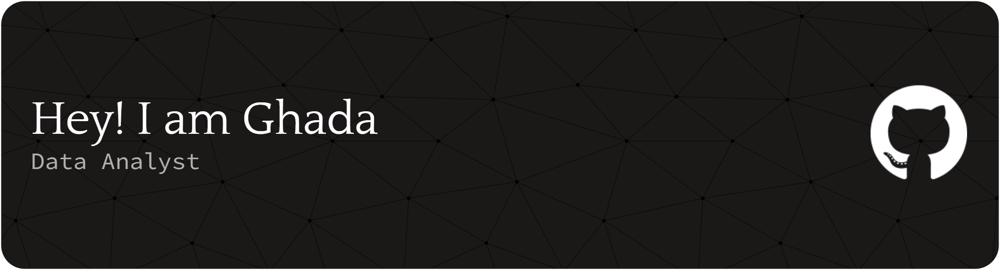

  <blockquote>
    I help businesses make smarter decisions through data analysis, visualization, and compelling storytelling. 
    Let's unlock the value in your data.
  </blockquote>

---

## Skills

  
  
  
   
  
  

---
## Connect with me! 📫

  
  
  

